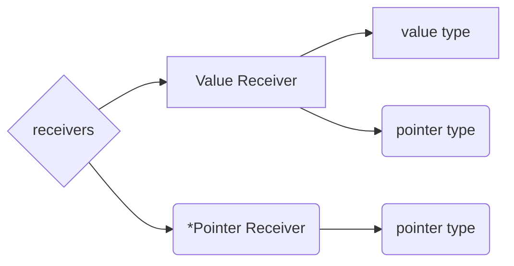

# Data Structures

<!-- TOC -->

- [Data Structures](#data-structures)
    - [Arrays](#arrays)
    - [Slices](#slices)
    - [Maps](#maps)
    - [Structs](#structs)
    - [Interfaces](#interfaces)

<!-- /TOC -->

## Arrays

- An [array](https://golang.org/ref/spec#Array_types ) is a numbered sequence of elements of a single type
  - The number of elements is called the length and is never negative. 
  - The length is part of the array's type; it must evaluate to a non-negative constant representable by a value of type `int`. 
  - The length of an array a can be discovered using the built-in function `len()`. 
  - The elements can be addressed by integer indices `0` through `len(a)-1`. 
  - Array types are always one-dimensional but may be composed to form multi-dimensional types. 
  - *Not dynamic* (does not change in size)

## Slices

- A [slice](https://golang.org/ref/spec#Slice_types) is a descriptor for a contiguous segment of an underlying array and provides access to a numbered sequence of elements from that array. 
- The value of an uninitialized slice is nil. 
- it is a reference type
- Like arrays, slices are indexable and have a length. 
- The length of a slice s can be discovered by the built-in function `len`; 
  - *Unlike arrays, slices are dynamic*
    - their length may change during execution. 
- The elements can be addressed by integer indices `0` through `len(s)-1`.
- A slice, once initialized, is always associated with an underlying array that holds its elements. 
  - it is a reference type
- The array underlying a slice may extend past the end of the slice. 
  - Capacity is a measure of that extent: 
    - it is the sum of the length of the slice and the length of the array beyond the slice; 
  - The capacity of a slice a can be discovered using the built-in function `cap(a)`. 
- [Go Slices: usage and internals](https://blog.golang.org/go-slices-usage-and-internals)

### `make`
- A new, initialized slice value for a given element type T is made using the built-in function make, which takes a slice type and parameters specifying the length and optionally the capacity. 
- A slice created with make always allocates a new, hidden array to which the returned slice value refers. 
  - make([]T, length, capacity) 
  - make([]int, 50, 100) 
    - same as this: new([100]int)[0:50] 
- Like arrays, slices are always one-dimensional but may be composed to construct higher-dimensional objects. (multi-dimensional slices)

## Maps

- A [map](https://golang.org/ref/spec#Map_types) is an unordered group of elements of one type, called the element type, indexed by a set of unique keys of another type, called the key type. Field names may be specified explicitly (*IdentifierList*) or implicitly (*AnonymousField*).
  - key / value storage
  - a “dictionary”
- The value of an uninitialized map is `nil`.
- [Macro View of Map Internals In Go](https://www.ardanlabs.com/blog/2013/12/macro-view-of-map-internals-in-go.html)

## Structs

- A [struct](https://golang.org/ref/spec#Struct_types) is a sequence of named elements, called *fields*, each of which has a name and a type.
- a data structure
- a composite type
- allows us to collect properties together
- [Composition with Go](http://goinggo.net/2015/09/composition-with-go.html)

## Interfaces

- *Method Sets*
  - receivers
    - value receiver
      - value type
      - pointer type
    - pointer receiver 
      - pointer type

